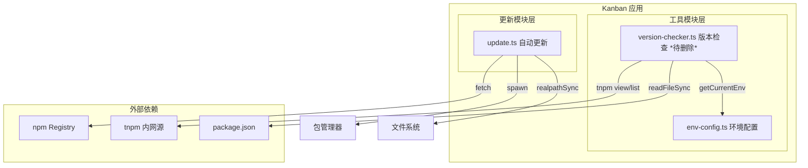

> **文档元信息**
>
> | 项目 | 内容 |
> |------|------|
> | 文档版本 | v1.0 |
> | 作者 | DTCoder |
> | 创建日期 | 2026-08-17 |
> | 需求来源 | 任务需求：version-checker.ts 整个模块无外部调用方，确认后可删 ~261 行（需先确认与 src/update/update.ts 的关系） |
> | 评审状态 | 待评审 |

# version-checker.ts 模块删除系分设计

## 1. 需求与范围

### 背景与目标

当前 `src/utils/version-checker.ts` 模块（261 行）提供了版本检查功能，包括：获取当前版本号、获取最新版本号、版本比较、版本缓存等功能。该模块与 `src/update/update.ts` 存在功能重叠。经代码分析确认，`version-checker.ts` 在整个仓库中无任何外部调用方（import 引用），其功能已被 `update.ts` 中独立实现的版本管理逻辑覆盖。

目标：确认 `version-checker.ts` 可安全删除，明确其与 `update.ts` 的关系，为删除提供依据。

### 核心功能

1. **模块调用关系分析**：确认 `version-checker.ts` 的入向引用和出向依赖
2. **功能重叠分析**：对比 `version-checker.ts` 与 `update.ts` 中版本管理功能的异同
3. **删除影响评估**：评估删除 `version-checker.ts` 后的影响范围

### 约束与非功能要求

- 删除不得影响 `update.ts` 的正常运行
- 删除不得影响项目编译和测试
- 依赖 `env-config.ts` 的公共能力需保留

### 排除范围

- 不涉及 `update.ts` 本身的重构或优化
- 不涉及 `env-config.ts` 的修改
- 不涉及测试框架的变更

### 需求功能清单与优先级

| 编号 | 功能点 | 优先级 | 原始描述 | 备注 |
|------|--------|--------|----------|------|
| F01 | 模块调用关系确认 | P0 | version-checker.ts 整个模块无外部调用方 | 确认无 import 引用 |
| F02 | 与 update.ts 的关系确认 | P0 | 需先确认与 src/update/update.ts 的关系 | 确认功能重叠与独立性 |
| F03 | 删除影响评估 | P0 | 确认后可删 ~261 行 | 评估删除风险 |
| F04 | 输出系分设计文档 | P1 | 产出设计文档 | 归档分析结论 |

### 假设与待确认项

| 编号 | 假设/待确认内容 | 当前假设 | 确认状态 |
|------|-----------------|----------|----------|
| A01 | version-checker.ts 无外部调用方 | 经代码搜索确认，仅被自身引用 | 已确认 |
| A02 | update.ts 不依赖 version-checker.ts | 经代码分析确认无 import 引用 | 已确认 |
| A03 | 删除后不影响编译 | 需删除后验证 | 待确认 |
| A04 | 删除后不影响测试 | 需删除后验证 | 待确认 |

## 2. 架构与模块

### 功能架构



### 模块清单

| 模块 | 职责 | 依赖 |
|------|------|------|
| version-checker.ts | 版本号获取、比较、缓存（待删除） | env-config.ts, tnpm CLI, package.json |
| update.ts | 自动更新检测、安装、调度 | 包管理器（npm/pnpm/yarn/bun/npx）, npm Registry |
| env-config.ts | 环境配置（dev/pre/prod） | 无 |

### 功能重叠分析

| 功能维度 | version-checker.ts | update.ts | 分析结论 |
|----------|-------------------|-----------|----------|
| 版本号解析 | `parseVersion()` 自定义解析，支持 pre/dev 时间戳 | `parseVersion()` 自定义解析，支持 nightly/prerelease | 独立实现，无依赖关系 |
| 版本号比较 | `compareVersions()` 返回 boolean（是否需要更新） | `compareVersions()` 返回 number（-1/0/1 标准 semver 比较） | 独立实现，update.ts 更标准、更完善 |
| 获取最新版本 | 通过 `tnpm view` CLI 命令 | 通过 `fetch()` HTTP 请求 npm registry | 不同数据源，不同的实现策略 |
| 获取当前版本 | 从 package.json / tnpm list 读取 | 通过参数注入 | 策略不同，update.ts 更灵活 |
| 缓存机制 | 内存缓存，5分钟 TTL | 无显式缓存 | 不重要，删除后无影响 |
| 自动更新 | 仅检查，不自动更新 | 完整更新流程（安装、调度、回滚） | 范围不同 |
| 包管理器适配 | 无 | 支持 npm/pnpm/yarn/bun/npx | update.ts 更全面 |
| 多平台兼容 | 无 | 有 Windows .cmd 适配 | update.ts 更全面 |
| 调用方 | 无 | 被 auto-update.test.ts 测试文件引用 | update.ts 是活跃模块 |

### 结论

**version-checker.ts 与 update.ts 是完全独立的两个模块，互不依赖。** 删除 version-checker.ts 不会对 update.ts 产生任何影响。

### 应用集成架构

本项不适用，原因：本次设计为模块删除分析，不涉及外部系统集成或无新增集成架构变更。

### 部署架构

本项不适用，原因：本次设计为模块删除分析，不涉及部署架构变更。

## 3. 数据模型与存储

本项不适用，原因：本次设计为模块删除分析，version-checker.ts 不涉及数据持久化存储（仅内存缓存），无实体模型需要设计。

### 缓存说明

version-checker.ts 使用内存对象 `versionCache` 缓存版本号，TTL 为 5 分钟。该缓存为模块内部私有状态，无外部依赖。删除后无数据残留问题。

## 4. 接口设计

本项不适用，原因：version-checker.ts 为内部工具模块，不对外暴露 HTTP 接口或 API 端点。

### 导出接口清单

| 编号 | 接口名称 | 类型 | 方法签名 | 模块 | 状态 |
|------|----------|------|----------|------|------|
| E01 | getCurrentVersion | 导出函数 | `getCurrentVersion(): string` | version-checker.ts | 无调用方 |
| E02 | getLatestVersion | 导出函数 | `getLatestVersion(): string` | version-checker.ts | 无调用方 |
| E03 | compareVersions | 导出函数 | `compareVersions(current: string, latest: string): boolean` | version-checker.ts | 无调用方 |
| E04 | clearVersionCache | 导出函数 | `clearVersionCache(): void` | version-checker.ts | 无调用方 |
| E05 | getLatestVersionAsync | 导出函数 | `getLatestVersionAsync(timeoutMs?: number): Promise<string>` | version-checker.ts | 无调用方 |
| E06 | checkVersionUpdate | 导出函数 | `checkVersionUpdate(timeoutMs?: number): Promise<{...}>` | version-checker.ts | 无调用方 |

所有导出接口均无外部调用方，删除无影响。

## 5. 功能模块设计

### 5.1 version-checker.ts 模块详细分析

#### 5.1.1 模块结构

| 组件 | 类型 | 行号 | 说明 |
|------|------|------|------|
| versionCache | 变量 | 13-17 | 内存缓存对象，存储 currentVersion、latestVersion、timestamp |
| CACHE_TTL | 常量 | 20 | 缓存有效期 5 分钟 |
| getTagForEnv() | 函数 | 25-34 | 根据环境获取 tnpm 标签 |
| getVersionFromPackageJson() | 函数 | 39-48 | 从 package.json 读取版本号 |
| getCurrentVersion() | 导出函数 | 53-85 | 获取当前版本（优先缓存，其次 package.json，最后 tnpm list） |
| getLatestVersion() | 导出函数 | 90-116 | 获取最新版本（通过 tnpm view） |
| parseVersion() | 函数 | 123-146 | 解析版本号，支持 pre/dev 预发布标识 |
| compareVersions() | 导出函数 | 154-177 | 比较版本号，判断是否需要更新 |
| clearVersionCache() | 导出函数 | 183-187 | 清除版本缓存 |
| getLatestVersionAsync() | 导出函数 | 194-227 | 异步获取最新版本（带超时） |
| checkVersionUpdate() | 导出函数 | 234-261 | 版本更新检查（仅检查，不自动更新） |

#### 5.1.2 内部依赖关系

| 依赖 | 类型 | 说明 |
|------|------|------|
| `node:child_process` | Node 内置 | execSync 执行 tnpm 命令 |
| `node:fs` | Node 内置 | readFileSync 读取 package.json |
| `node:path` | Node 内置 | 路径处理 |
| `node:url` | Node 内置 | fileURLToPath 转换 |
| `./env-config.js` | 内部模块 | getCurrentEnv 获取当前环境 |

#### 5.1.3 与 update.ts 功能对比

| 功能 | version-checker.ts | update.ts | 差异分析 |
|------|-------------------|-----------|----------|
| 版本号解析 | `parseVersion()` 支持 `{major}.{minor}.{patch}-{pre\|dev}.{timestamp}` | `parseVersion()` 支持标准 semver 和 nightly | 格式不同，独立实现 |
| 版本比较 | `compareVersions()` 返回 boolean（是否需要更新） | `compareVersions()` 返回 number（-1/0/1 标准 semver 比较） | 语义不同，update.ts 更标准 |
| 获取最新版本 | 通过 `tnpm view` CLI 命令 | 通过 `fetch()` HTTP 请求 npm registry | 源不同，方式不同 |
| 获取当前版本 | 从 package.json / tnpm list | 通过参数注入 | 策略不同 |
| 缓存 | 内存缓存 5 分钟 TTL | 无 | 差异 |
| 自动更新 | 仅检查，不更新 | 完整更新流程（安装、调度、回滚） | 范围不同 |
| 包管理器适配 | 无 | 支持 npm/pnpm/yarn/bun/npx | 差异 |
| 多平台兼容 | 无 | 有 Windows .cmd 适配 | 差异 |

#### 5.1.4 删除风险矩阵

| 风险项 | 概率 | 影响 | 缓解措施 |
|--------|------|------|----------|
| 有遗漏的隐式引用 | 低 | 高 | 确认 grep 搜索覆盖所有 .ts/.js 文件，排除 node_modules |
| CI 构建因删除失败 | 低 | 高 | 删除后执行 tsc 编译检查 |
| 运行时依赖（如动态 import） | 极低 | 高 | 静态分析无法覆盖动态 import，但 TypeScript 项目通常不使用 |
| 测试用例引用 | 低 | 中 | 确认无测试文件引用 version-checker |
| env-config.ts 间接依赖 | 无 | 无 | version-checker 仅使用 getCurrentEnv，不影响其他模块 |

### 5.2 删除方案对比

| 方案 | 描述 | 优点 | 缺点 | 推荐 |
|------|------|------|------|------|
| 方案A：直接删除 | 删除 version-checker.ts 整个文件 | 最简洁，0 维护成本 | 不可逆（git 可恢复） | ✅ 推荐 |
| 方案B：标记废弃 | 保留文件但添加 @deprecated 标记 | 保留历史引用 | 遗留死代码，持续维护负担 | |
| 方案C：功能合并 | 将有用功能合并到 update.ts | 集中版本管理 | 引入额外变更风险，无实际调用方 | |

**推荐方案：方案A（直接删除）**。理由：模块无外部调用方，功能已被 update.ts 覆盖，保留仅有维护负担。

### 5.3 删除步骤

1. 执行 git 删除 `src/utils/version-checker.ts` 文件
2. 运行 `tsc` 编译检查确认无报错
3. 运行相关测试用例确认无回归
4. 提交 commit（含 `Co-authored-by: DTCoder <noreply@dtcoder.local>`）

## 6. 非功能性需求设计

本项不适用，原因：本次设计为模块删除分析，不涉及新功能开发或非功能性需求设计。

| 子章节 | 说明 |
|--------|------|
| 6.1 高可用性 | 不适用。删除旧模块不会影响系统可用性。 |
| 6.2 可扩展性 | 不适用。删除死代码可降低维护成本，间接提升可扩展性。 |
| 6.3 稳定性/可靠性 | 不适用。删除无调用方模块不会影响系统稳定性。 |
| 6.4 安全性设计 | 不适用。删除操作不涉及安全功能变更。 |
| 6.5 监控/统计/日志/告警 | 不适用。删除操作不涉及监控变更。 |

## 7. 变更三板斧

### 7.1 可监控

删除 version-checker.ts 后，update.ts 的版本检查和更新功能仍正常运行。可监控点：
- update.ts 的自动更新检测日志（`runAutoUpdateCheck`）
- 按需更新结果（`runOnDemandUpdate` 返回的 status）
- 启动时更新通知（`getPendingUpdateNotification`）

### 7.2 可灰度

本项不适用，原因：删除死代码为一次性操作，无需灰度。建议在 PR 评审后一次性合并。

### 7.3 可应急

如删除后发现意外问题，可通过 git revert 恢复：
```bash
git revert <commit-hash>
```
version-checker.ts 的删除不会影响数据层，回滚无兼容性问题。