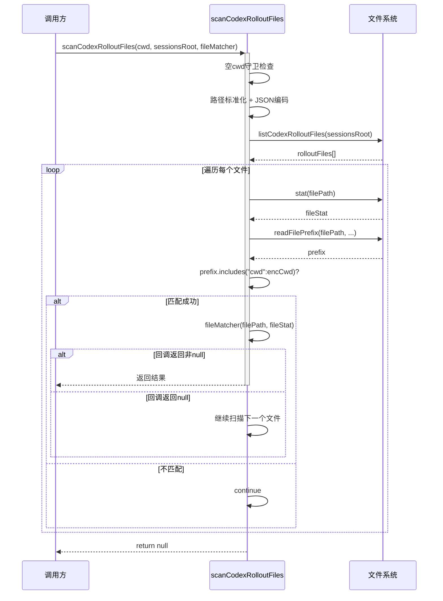

> **文档元信息**
>
> | 项目 | 内容 |
> |------|------|
> | 文档版本 | v1.0 |
> | 作者 | DTCoder |
> | 创建日期 | 2026-08-17 |
> | 需求来源 | 重复扫描循环 — `src/commands/hook-events/codex-hook-events.ts:278-301` 与 `:334-350` |
> | 评审状态 | 待评审 |

# Codex Rollout 文件扫描循环 — 重复代码提取系分设计

## 1. 需求与范围

### 背景与目标

在 `src/commands/hook-events/codex-hook-events.ts` 文件中，两个函数 `resolveCodexRolloutFinalMessageForCwd`（行 267-320）和 `findCodexRolloutFileForCwd`（行 322-357）存在近 20 行的重复扫描逻辑。

**目标**：提取公共扫描循环逻辑为可复用的 helper 函数，消除重复代码，提升可维护性。

### 核心功能

1. 提取「Codex rollout 文件扫描循环」为一个通用 helper
2. 保留各调用函数的差异化逻辑（`findFinalMessageFromSessionCwd` 的 tail 扫描逻辑、`findCodexRolloutFileForCwd` 的 mtime 过滤逻辑）
3. 不改变现有函数的对外接口和行为

### 约束与非功能要求

- 保持向后兼容：两个函数的签名、返回值、行为不得变更
- 零功能变更：仅提取重复代码，不修改业务逻辑
- 代码质量：提取后的 helper 应职责单一、参数化清晰

### 排除范围

- 不涉及其他文件中的重复代码
- 不涉及架构调整
- 不涉及测试用例变更（重构后行为不变，现有测试应继续通过）
- 不涉及数据模型、接口设计、非功能性需求、变更三板斧

### 需求功能清单与优先级

| 编号 | 功能点 | 优先级 | 原始描述 | 备注 |
|------|--------|--------|----------|------|
| F01 | 提取公共扫描循环为 helper 函数 | P0 | 重复扫描循环 — lines 278-301 与 334-350 | 核心需求 |
| F02 | 保持两个调用函数原有行为不变 | P0 | 同上 | 零功能变更 |
| F03 | 确保 helper 函数职责单一、参数化清晰 | P1 | 同上 | 代码质量 |

### 假设与待确认项

| 编号 | 假设/待确认内容 | 当前假设 | 确认状态 |
|------|-----------------|----------|----------|
| A01 | 两个函数属于同一文件，helper 放在同一文件中 | 同一文件内提取，不新增文件 | 待确认 |
| A02 | helper 函数命名为 `scanCodexRolloutFiles` | 命名清晰体现"扫描 + 回调"模式 | 待确认 |

---

## 2. 架构与模块

### 本项不适用

**原因**：本次设计仅涉及单文件内部两个函数之间的重复代码提取，不涉及架构调整、模块划分、集成架构或部署架构变更。

该文件所属模块为 `hook-events`（命令事件处理模块），职责是监听和处理 Codex 会话的 rollout 日志事件。本次重构仅在该模块内部进行，不改变模块边界和依赖关系。

---

## 3. 数据模型与存储

### 本项不适用

**原因**：本次设计不涉及数据库实体、缓存或消息队列，仅涉及 TypeScript 代码层面的重复代码提取。

---

## 4. 接口设计

### 本项不适用

**原因**：本次设计不涉及对外/对内接口变更，仅涉及内部函数重构。`resolveCodexRolloutFinalMessageForCwd` 和 `findCodexRolloutFileForCwd` 两个导出函数的签名保持不变。

---

## 5. 功能模块设计

### 5.1 重复代码分析

#### 5.1.1 重复模式识别

两个函数共享以下重复代码段：

**重复段 A — 函数入口守卫**：
```
if (!cwd.trim()) { return null; }
```

**重复段 B — 路径标准化**：
```
const normalizedCwd = normalizePathForComparison(cwd);
const encodedCwd = JSON.stringify(normalizedCwd);
```

**重复段 C — 文件列表获取**：
```
const rolloutFiles = (await listCodexRolloutFiles(sessionsRoot)).slice(0, MAX_CODEX_ROLLOUT_FILES_TO_SCAN);
```

**重复段 D — 文件扫描循环 + stat + 异常处理**：
```
for (const filePath of rolloutFiles) {
    let fileStat: Stats;
    try { fileStat = await stat(filePath); } catch { continue; }
    // ...
}
```

**重复段 E — prefix 读取 + 异常处理**：
```
let prefix = "";
try {
    prefix = await readFilePrefix(filePath, Math.min(fileStat.size, CODEX_ROLLOUT_MATCH_SCAN_BYTES));
} catch { continue; }
```

**重复段 F — cwd 匹配检查**：
```
if (!prefix.includes(`"cwd":${encodedCwd}`)) { continue; }
```

#### 5.1.2 差异分析

| 差异点 | `resolveCodexRolloutFinalMessageForCwd` | `findCodexRolloutFileForCwd` |
|--------|----------------------------------------|------------------------------|
| mtime 过滤 | 无 | 有（`fileStat.mtimeMs < sessionStartedAtMs - CODEX_ROLLOUT_FILE_FRESH_WINDOW_MS`） |
| 匹配后操作 | 读取 tail 扫描日志，寻找 final message | 直接返回 filePath |
| 返回值类型 | `Promise<string \| null>` | `Promise<string \| null>` |
| 额外参数 | 无 | `sessionStartedAtMs: number` |

#### 5.1.3 方案对比

| 方案 | 描述 | 优点 | 缺点 |
|------|------|------|------|
| **A: 回调式 helper（推荐）** | 提取 `scanCodexRolloutFiles<T>`，接收回调处理匹配文件 | 职责分离、类型安全、复用性强 | 多一层间接调用 |
| B: 迭代器式 helper | 返回 `AsyncIterable<{filePath, fileStat}>` | 控制流更灵活 | 调用方仍需处理重复逻辑，复杂度高 |
| C: 保持现状 | 不做提取 | 零改动风险 | 持续违反 DRY，维护成本递增 |

**推荐方案 A**。理由：最符合当前代码库的 async/await 风格，改动量最小，不影响现有导出函数签名。

---

### 5.2 Helper 函数详细设计

#### 5.2.1 函数签名

```typescript
async function scanCodexRolloutFiles<T>(
  cwd: string,
  sessionsRoot: string,
  fileMatcher: (filePath: string, fileStat: Stats) => Promise<T | null>,
): Promise<T | null>
```

**参数说明**：

| 参数 | 类型 | 说明 |
|------|------|------|
| cwd | `string` | 要匹配的工作目录路径 |
| sessionsRoot | `string` | Codex sessions 根目录路径 |
| fileMatcher | `(filePath: string, fileStat: Stats) => Promise<T \| null>` | 匹配到文件后的回调函数，返回非 null 值则提前结束扫描 |

**返回值**：`Promise<T | null>` — 第一个匹配文件返回回调结果，无匹配返回 null。

#### 5.2.2 业务规则

1. **空 cwd 守卫**：`if (!cwd.trim()) return null`
2. **路径标准化**：`normalizePathForComparison` + `JSON.stringify`
3. **文件列表获取**：`listCodexRolloutFiles` + `slice(0, MAX_CODEX_ROLLOUT_FILES_TO_SCAN)`
4. **逐文件遍历**：对每个文件执行 `stat`，异常跳过
5. **prefix 读取**：`readFilePrefix(filePath, Math.min(fileStat.size, CODEX_ROLLOUT_MATCH_SCAN_BYTES))`，异常跳过
6. **cwd 匹配**：检查 `prefix.includes(\`"cwd":${encodedCwd}\`)`，不匹配则跳过
7. **回调执行**：匹配后调用 `fileMatcher(filePath, fileStat)`，返回非 null 值则立即返回

#### 5.2.3 异常场景

| 异常场景 | 处理方式 |
|----------|----------|
| filePath 无法 stat | 跳过（continue），不影响其他文件 |
| readFilePrefix 失败 | 跳过（continue），不影响其他文件 |
| 所有文件都无匹配 | 返回 null |

#### 5.2.4 改造后函数设计

**`resolveCodexRolloutFinalMessageForCwd`（改造后）**：

```typescript
export async function resolveCodexRolloutFinalMessageForCwd(
  cwd: string,
  sessionsRoot = join(homedir(), ".codex", "sessions"),
): Promise<string | null> {
  return scanCodexRolloutFiles(cwd, sessionsRoot, async (filePath, fileStat) => {
    let scanText = "";
    try {
      scanText = await readFileTail(filePath, fileStat.size, CODEX_ROLLOUT_TAIL_SCAN_BYTES);
    } catch {
      return null;
    }
    const lines = scanText.split(/\r?\n/);
    for (let index = lines.length - 1; index >= 0; index -= 1) {
      const line = lines[index]?.trim();
      if (!line) continue;
      const parsedLine = parseJsonObject(line);
      if (!parsedLine) continue;
      const finalMessage = extractFinalMessageFromRolloutLine(parsedLine);
      if (finalMessage) return finalMessage;
    }
    return null;
  });
}
```

**`findCodexRolloutFileForCwd`（改造后）**：

```typescript
async function findCodexRolloutFileForCwd(
  cwd: string,
  sessionStartedAtMs: number,
  sessionsRoot: string,
): Promise<string | null> {
  return scanCodexRolloutFiles(cwd, sessionsRoot, async (filePath, fileStat) => {
    if (fileStat.mtimeMs < sessionStartedAtMs - CODEX_ROLLOUT_FILE_FRESH_WINDOW_MS) {
      return null;  // 跳过不新鲜的文件，继续扫描
    }
    return filePath;
  });
}
```

#### 5.2.5 调用时序图



#### 5.2.6 并发控制

本设计不涉及数据写入，无并发风险。

#### 5.2.7 状态机设计

本设计不涉及状态字段，不适用。

#### 5.2.8 模块自检

**完备性对账表**：

| 需求编号 | 设计覆盖 | 状态 |
|----------|----------|------|
| F01 | 5.2.1 Helper 函数设计 — `scanCodexRolloutFiles` | ✅ |
| F02 | 5.2.4 改造后函数设计 — 签名和返回值不变 | ✅ |
| F03 | 5.2.1 参数化设计 — 泛型 T + 回调 fileMatcher | ✅ |

**过度设计检查**：

| 检查项 | 结论 |
|--------|------|
| 是否过度抽象 | 否。提取的重复代码段明确且稳定（6段），helper 职责单一 |
| 是否引入不必要的复杂性 | 否。回调模式简单直观，与当前 async/await 风格一致 |
| 是否过度参数化 | 否。仅 3 个参数，其中 fileMatcher 是核心扩展点 |

---

## 6. 非功能性需求设计

### 本项不适用

**原因**：本次设计为纯代码质量重构（消除重复代码），不涉及性能、安全性、可用性、扩展性等非功能性需求。重构后的代码执行路径与原代码一致，不会引入新的性能开销或安全风险。

---

## 7. 变更三板斧

### 本项不适用

**原因**：本次设计为代码重构，不涉及线上服务变更，因此不需要灰度发布、监控埋点或应急回滚方案。重构后的代码通过 CI 测试即视为验证通过。