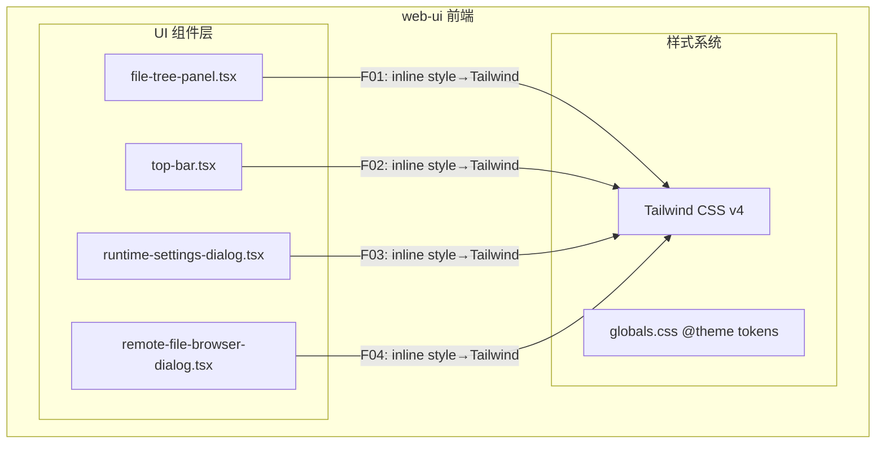

> **文档元信息**
>
> | 项目 | 内容 |
> |------|------|
> | 文档版本 | v1.0 |
> | 作者 | DTCoder |
> | 创建日期 | 2026-08-17 |
> | 需求来源 | 任务: 静态 inline style 换 Tailwind — file-tree-panel.tsx:46、top-bar.tsx:583、runtime-settings-dialog.tsx:1323、remote-file-browser-dialog.tsx:259 |
> | 评审状态 | 待评审 |

# 静态 Inline Style 替换 Tailwind 系分设计

## 1. 需求与范围
### 背景与目标
当前 web-ui 仓库中存在若干处使用 `style={{...}}` 内联样式的情况。为统一代码风格、提升可维护性并充分利用 Tailwind CSS 的 utility-first 体系，需将指定位置的静态 inline style 替换为等价的 Tailwind class。

### 核心功能
将 4 个文件中 4 处静态 inline style 替换为 Tailwind 类名，保持视觉效果完全一致。

### 约束与非功能要求
- 视觉零差异：替换后渲染结果与替换前严格一致
- 仅替换静态值（不包含动态计算/变量引用的 `style`）
- 不引入额外 CSS 或覆盖规则
- 遵循现有 Tailwind 设计 tokens（见 `globals.css` `@theme`）

### 排除范围
- 动态 inline style（如根据 state 计算的样式）不在本次范围内
- 非本次指定的 4 处 inline style 不在本次范围内
- 不涉及组件逻辑、类型、接口变更

### 需求功能清单与优先级

| 编号 | 功能点 | 优先级 | 原始位置 | 备注 |
|------|--------|--------|----------|------|
| F01 | file-tree-panel.tsx 第46行 inline style 替换 | P0 | `style={{ marginLeft: "auto", fontSize: 10, display: "flex", gap: 4 }}` | 纯机械替换 |
| F02 | top-bar.tsx 第583行 inline style 替换 | P0 | `style={{ width: 24, paddingLeft: 0, paddingRight: 0 }}` | 纯机械替换 |
| F03 | runtime-settings-dialog.tsx 第1329行 inline style 替换 | P0 | `style={{ minWidth: 220 }}` (NativeSelect 组件) | 实际位于第1329行，非第1323行 |
| F04 | remote-file-browser-dialog.tsx 第259行 inline style 替换 | P0 | `style={{ minHeight: 200, maxHeight: 360 }}` | 纯机械替换 |

### 假设与待确认项

| 编号 | 假设/待确认内容 | 当前假设 | 确认状态 |
|------|-----------------|----------|----------|
| A01 | runtime-settings-dialog.tsx 需求指定行号1323与实际inline style所在行1329不一致 | 假设需求意图为替换 NativeSelect 上的 `style={{ minWidth: 220 }}`，行号偏差为需求文档误差 | 待确认 |
| A02 | NativeSelect 组件支持 className 属性 | 已验证：NativeSelect 组件接受 className 并应用到内部 select 元素 | 已确认 |
| A03 | Button 组件支持 className 属性 | 已验证：Button 组件通过 cn() 合并 className | 已确认 |

## 2. 架构与模块
### 功能架构
本次变更仅涉及 web-ui 前端展示层，不涉及架构层面的改动。



**模块清单**

| 模块 | 职责 | 变更影响 |
|------|------|----------|
| file-tree-panel.tsx | 文件树面板组件，展示文件变更统计 | 第46行 `<span>` 的 inline style → Tailwind class |
| top-bar.tsx | 顶部工具栏组件，含快捷操作选择器 | 第583行 `<Button>` 的 inline style → Tailwind class |
| runtime-settings-dialog.tsx | 运行时设置对话框 | 第1329行 `<NativeSelect>` 的 inline style → Tailwind class |
| remote-file-browser-dialog.tsx | 远程文件浏览器对话框 | 第259行 `<div>` 的 inline style → Tailwind class |

### 应用集成架构
不适用。本次变更为纯前端样式替换，不涉及集成架构变更。

### 部署架构
不适用。本次变更不涉及部署架构调整。

## 3. 数据模型与存储
本项不适用，原因：本次变更为前端样式替换，不涉及数据模型或存储变更。

## 4. 接口设计
本项不适用，原因：本次变更为前端样式替换，不涉及接口设计变更。

## 5. 功能模块设计

### 5.1 file-tree-panel.tsx (F01)
#### 5.1.1 变更详情
- **文件路径**: `web-ui/src/components/detail-panels/file-tree-panel.tsx`
- **行号**: 46
- **原始代码**:
  ```tsx
  <span className="font-mono" style={{ marginLeft: "auto", fontSize: 10, display: "flex", gap: 4 }}>
  ```
- **替换后代码**:
  ```tsx
  <span className="font-mono ml-auto text-[10px] flex gap-1">
  ```
- **映射说明**:

| 原始 CSS | Tailwind 等价类 | 说明 |
|----------|----------------|------|
| `marginLeft: "auto"` | `ml-auto` | 标准 Tailwind margin auto 类 |
| `fontSize: 10` | `text-[10px]` | 10px 不在标准字号 scale 中，使用 arbitrary value |
| `display: "flex"` | `flex` | 标准 Tailwind flex 类 |
| `gap: 4` | `gap-1` | 4px = 1 Tailwind 单位 |

#### 5.1.2 风险与注意事项
- 零风险：纯静态值替换，不涉及动态计算
- 注意：`className` 属性需合并原有 `font-mono` 与新类

### 5.2 top-bar.tsx (F02)
#### 5.2.1 变更详情
- **文件路径**: `web-ui/src/components/top-bar.tsx`
- **行号**: 583
- **原始代码**:
  ```tsx
  <Button
    size="sm"
    variant="default"
    icon={<ChevronDown size={12} />}
    aria-label="Select shortcut"
    disabled={Boolean(runningShortcutLabel)}
    className="rounded-l-none border-l-0 kb-navbar-btn"
    style={{ width: 24, paddingLeft: 0, paddingRight: 0 }}
  />
  ```
- **替换后代码**:
  ```tsx
  <Button
    size="sm"
    variant="default"
    icon={<ChevronDown size={12} />}
    aria-label="Select shortcut"
    disabled={Boolean(runningShortcutLabel)}
    className="rounded-l-none border-l-0 kb-navbar-btn w-6 px-0"
  />
  ```
- **映射说明**:

| 原始 CSS | Tailwind 等价类 | 说明 |
|----------|----------------|------|
| `width: 24` | `w-6` | 24px = 6 Tailwind 单位 (24/4) |
| `paddingLeft: 0, paddingRight: 0` | `px-0` | 标准 Tailwind padding 类 |

#### 5.2.2 风险与注意事项
- 零风险：纯静态值替换，Button 组件已支持 className 合并
- 注意：`className` 需合并原有 `rounded-l-none border-l-0 kb-navbar-btn` 与新类

### 5.3 runtime-settings-dialog.tsx (F03)
#### 5.3.1 变更详情
- **文件路径**: `web-ui/src/components/runtime-settings-dialog.tsx`
- **行号**: 1329（需求指定1323，实际inline style位于1329行）
- **原始代码**:
  ```tsx
  <NativeSelect
    value={selectedPromptVariant}
    onChange={(event) => setSelectedPromptVariant(event.target.value as TaskGitAction)}
    disabled={controlsDisabled}
    style={{ minWidth: 220 }}
  >
  ```
- **替换后代码**:
  ```tsx
  <NativeSelect
    value={selectedPromptVariant}
    onChange={(event) => setSelectedPromptVariant(event.target.value as TaskGitAction)}
    disabled={controlsDisabled}
    className="min-w-[220px]"
  >
  ```
- **映射说明**:

| 原始 CSS | Tailwind 等价类 | 说明 |
|----------|----------------|------|
| `minWidth: 220` | `min-w-[220px]` | 220px 不在标准 scale 中，使用 arbitrary value |

#### 5.3.2 NativeSelect 组件兼容性分析
- NativeSelect 组件接受 `className` prop，通过 `getNativeSelectClassName()` 内部使用 `cn()` 合并到 select 元素
- 使用 `className="min-w-[220px]"` 即可将样式应用于内部 `<select>` 元素
- 备选方案：使用 `containerClassName="min-w-[220px]"` 作用于外层 `<div>` 容器
- **推荐方案**: 使用 `className="min-w-[220px]"` 直接作用于 select 元素，与原始 inline style 行为一致

#### 5.3.3 风险与注意事项
- 零风险：NativeSelect 组件已支持 className 属性
- 行号偏差已记录在假设表中

### 5.4 remote-file-browser-dialog.tsx (F04)
#### 5.4.1 变更详情
- **文件路径**: `web-ui/src/components/remote-file-browser-dialog.tsx`
- **行号**: 259
- **原始代码**:
  ```tsx
  <div
    className="flex-1 min-h-0 overflow-y-auto border-t border-b border-border"
    style={{ minHeight: 200, maxHeight: 360 }}
  >
  ```
- **替换后代码**:
  ```tsx
  <div
    className="flex-1 overflow-y-auto border-t border-b border-border min-h-[200px] max-h-[360px]"
  >
  ```
- **映射说明**:

| 原始 CSS | Tailwind 等价类 | 说明 |
|----------|----------------|------|
| `minHeight: 200` | `min-h-[200px]` | 任意值，覆盖原有的 `min-h-0` |
| `maxHeight: 360` | `max-h-[360px]` | 任意值 |

#### 5.4.2 设计决策说明
- **移除 `min-h-0` 的原因**：原始代码中 `min-h-0` 被 inline style `minHeight: 200` 覆盖，替换后 `min-h-[200px]` 已包含 min-height 语义，无需保留 `min-h-0`
- 若为明确语义保留 `min-h-0`，需注意 Tailwind 类名顺序，`min-h-[200px]` 需出现在 `min-h-0` 之后才能生效

#### 5.4.3 风险与注意事项
- 零风险：纯静态值替换
- 移除了被覆盖的 `min-h-0` 类

## 6. 非功能性需求设计
### 6.1 可维护性
- **提升**：将 inline style 转换为 Tailwind class 后，样式定义统一在 className 中管理，便于后续维护和主题切换
- **一致性**：与项目中已有的 Tailwind 使用风格保持一致

### 6.2 可扩展性
- 替换为 Tailwind class 后，后续可通过 `@theme` 自定义属性统一调整主题色、间距等

### 6.3 稳定性/可靠性
- 替换为纯 class 定义，不涉及运行时 style 对象创建，性能略有提升
- 无功能逻辑变更，无回归风险

### 6.4 安全性设计
本项不适用，原因：样式替换不涉及安全相关变更。

### 6.5 监控/统计/日志/告警
本项不适用，原因：样式替换不涉及监控相关变更。

## 7. 变更三板斧
### 7.1 可监控
- 不涉及服务端监控埋点
- 建议变更后通过视觉回归测试（如 Storybook 视觉快照）验证零差异

### 7.2 可灰度
- 本次变更为纯前端样式替换，属于 CSS 级别变更，不涉及灰度策略
- 通过 PR review 和视觉对比即可确认变更正确性

### 7.3 可应急
- 若替换后出现视觉差异，直接回滚 PR 即可恢复
- 无上下游依赖，回滚零风险

---

## 设计决策记录

| 决策项 | 决策结果 | 备选方案 | 决策原因 |
|--------|----------|----------|----------|
| F03 className 目标 | 使用 `className="min-w-[220px]"` 作用于 select 元素 | ① `containerClassName` 作用于容器 div；② 保留 inline style | 与原始 inline style 行为一致，NativeSelect 支持 className 属性 |
| F04 min-h-0 处理 | 移除 `min-h-0` | 保留 `min-h-0` 并在其后放 `min-h-[200px]` | 简化 class 列表，避免冗余和被覆盖的类 |
