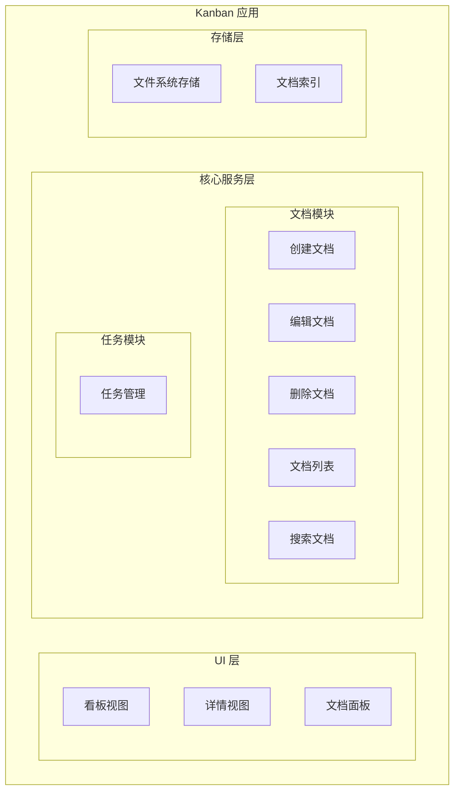
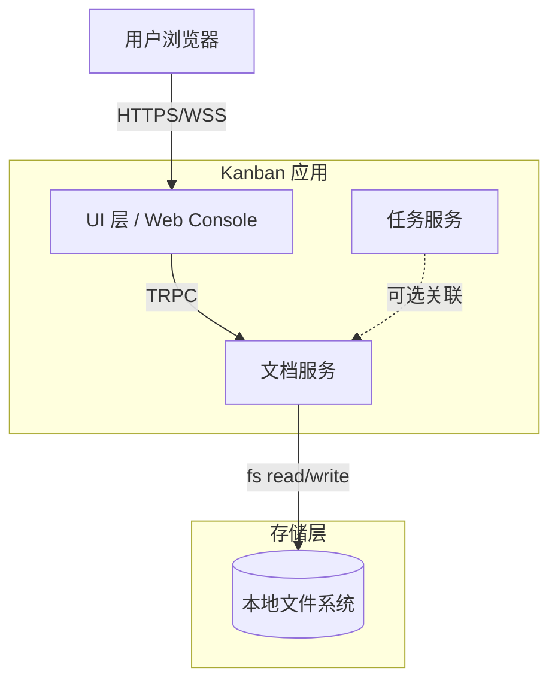
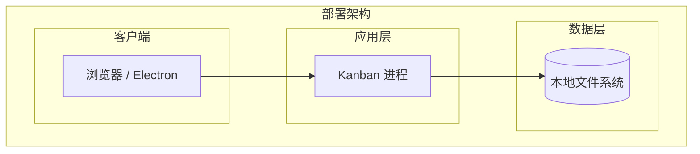
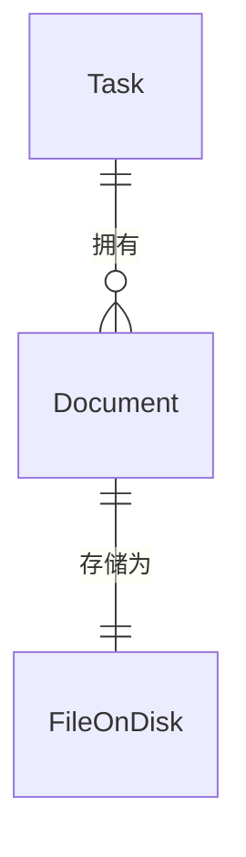
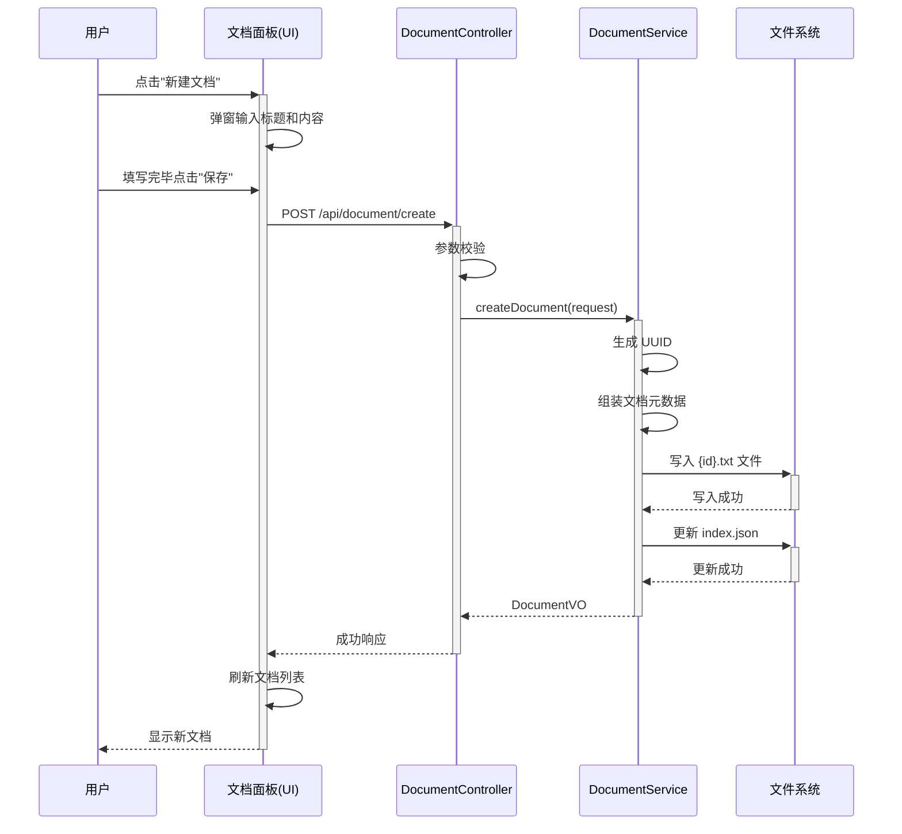

> **文档元信息**
>
> | 项目 | 内容 |
> |------|------|
> | 文档版本 | v1.0 |
> | 作者 | AiWork |
> | 创建日期 | 2026-09-11 |
> | 需求来源 | 任务输入：实现一个简单的txt文档 |
> | 评审状态 | 待评审 |

# 简单文档模块 系分设计

## 1. 需求与范围
- **背景与目标**：在 Kanban 任务管理看板中，支持用户创建简单的 txt 文本文档，作为任务描述、笔记记录或设计文档的载体。目标是提供轻量级的纯文本创建与管理能力，无富文本或二进制文件支持。
- **核心功能**：
  1. 用户可创建新的 txt 文本文档
  2. 用户可编辑已有 txt 文本文档内容
  3. 用户可删除 txt 文本文档
  4. 用户可查看 txt 文本文档列表
  5. 用户可搜索/筛选 txt 文本文档
- **约束与非功能要求**：
  - 纯文本格式（.txt），不支持富文本
  - 文档存储于本地文件系统
  - 单文档大小限制：不超过 1MB
  - 编码格式：UTF-8
- **排除范围**：
  - 不支持富文本/HTML/Markdown 渲染
  - 不支持二进制文件（图片、PDF 等）
  - 不支持多人协作编辑
  - 不提供版本历史/回滚功能

### 需求功能清单与优先级

| 编号 | 功能点 | 优先级 | PRD 原始描述/章节 | 备注 |
|------|--------|--------|-------------------|------|
| F01 | 创建 txt 文档 | P0 | 实现一个简单的txt文档 | 核心功能 |
| F02 | 编辑 txt 文档内容 | P0 | 实现一个简单的txt文档 | 核心功能 |
| F03 | 删除 txt 文档 | P1 | 实现一个简单的txt文档 | 基础管理 |
| F04 | 查看文档列表 | P1 | 实现一个简单的txt文档 | 浏览功能 |
| F05 | 搜索/筛选文档 | P2 | 实现一个简单的txt文档 | 体验优化 |

### 假设与待确认项

| 编号 | 假设/待确认内容 | 当前假设 | 确认状态 |
|------|-----------------|----------|----------|
| A01 | 文档存储位置 | 存储于本地文件系统 `~/.kanban/documents/` 目录 | 待确认 |
| A02 | 文档编码格式 | UTF-8 | 待确认 |
| A03 | 单文档大小上限 | 1MB | 待确认 |

## 2. 架构与模块

### 功能架构



- **UI 层**：在 Kanban 看板中新增文档面板，用户可通过文档面板进行文档的创建、编辑、删除、浏览和搜索操作
- **核心服务层**：文档模块负责全部文档业务逻辑，包括 CRUD 和搜索功能
- **存储层**：文档以纯文本文件形式存储于本地文件系统，并维护轻量索引用于搜索

**模块清单**

| 模块 | 职责 | 依赖 |
|------|------|------|
| 文档模块 | 纯文本文档的 CRUD、搜索、文件读写 | 文件系统 |
| 任务模块 | 任务卡片管理（已有模块） | 文档模块（可选关联） |

### 应用集成架构



**集成关系说明：**

| 调用方 | 被调用方 | 协议 | 接口类型 | 说明 |
|--------|----------|------|----------|------|
| 用户浏览器 | UI 层 | HTTPS/WSS | TRPC | 前端通过 TRPC 调用后端服务 |
| UI 层 | 文档服务 | TRPC | 内部 RPC | 文档 CRUD 操作 |
| 文档服务 | 本地文件系统 | fs | 文件 I/O | 读写 txt 文件 |

### 部署架构



**部署说明：**
- **客户端**：用户通过浏览器或 Electron 桌面应用访问
- **应用层**：Kanban 以本地 Node.js 进程运行，单进程无服务器依赖
- **数据层**：文档数据直接存储在用户的本地文件系统
- Kanban 为单用户本地应用，不涉及多实例部署和负载均衡

## 3. 数据模型与存储

### 实体清单

| 实体名称 | 实体说明 | 所属模块 | 与其他实体的关系 |
|----------|----------|----------|-----------------|
| Document | 纯文本文档 | 文档模块 | 可关联到 Task（多对一） |
| Task | 任务卡片（已有实体） | 任务模块 | 拥有多个 Document（一对多） |

### 实体关系图



**模型说明：**
- Task（任务卡片）是 Kanban 已有实体，一个 Task 可关联多个 Document
- Document 实体逻辑存在，实际内容以 .txt 文件存储于磁盘
- FileOnDisk 为磁盘文件抽象，非数据库实体

### 存储方案
- **文档内容**：以 `.txt` 文件存储于 `{kanban_data_dir}/documents/` 目录
- **文档元数据**：以 JSON 索引文件 `{kanban_data_dir}/documents/index.json` 存储（含文档名、创建时间、修改时间、关联任务ID等）
- **不使用数据库**：Kanban 为本地应用，纯文本文件 + JSON 索引足以满足轻量级需求
- **命名规范**：文件名 `{文档ID}.txt`，文档 ID 使用 UUID v4 格式
- **租户隔离**：不适用（Kanban 为单用户本地应用）

## 4. 接口设计

### 4.1 oneapi（Web 控制台接口）

| 编号 | 接口名称 | 方法 | 路径 | 模块 |
|------|----------|------|------|------|
| W01 | 创建文档 | POST | /api/document/create | 文档模块 |
| W02 | 获取文档内容 | GET | /api/document/get | 文档模块 |
| W03 | 更新文档内容 | POST | /api/document/update | 文档模块 |
| W04 | 删除文档 | POST | /api/document/delete | 文档模块 |
| W05 | 文档列表 | GET | /api/document/list | 文档模块 |
| W06 | 搜索文档 | GET | /api/document/search | 文档模块 |

### 4.2 OpenAPI（对外接口）

本项不适用，原因：Kanban 为本地桌面应用，不对外提供 OpenAPI 接口。

### 4.3 内部接口（Service 层）

| 编号 | 接口名称 | 类 | 方法签名 |
|------|----------|------|----------|
| S01 | 创建文档 | DocumentService | createDocument(request: CreateDocumentRequest): DocumentVO |
| S02 | 获取文档 | DocumentService | getDocument(documentId: string): DocumentVO |
| S03 | 更新文档 | DocumentService | updateDocument(request: UpdateDocumentRequest): DocumentVO |
| S04 | 删除文档 | DocumentService | deleteDocument(documentId: string): void |
| S05 | 文档列表 | DocumentService | listDocuments(filter: DocumentFilter): DocumentVO[] |
| S06 | 搜索文档 | DocumentService | searchDocuments(keyword: string): DocumentVO[] |

### 4.4 集成接口（Integration 层）

本项不适用，原因：无外部系统集成需求，文档服务直接与本地文件系统交互。

## 5. 功能模块设计

### 全局约定

| 约定项 | 取值 |
|--------|------|
| 错误码格式 | DOC_{SEQ} |
| 通用出参结构 | {code, msg, data} |

---

### 5.1 文档模块

#### 5.1.1 表结构设计

由于文档采用文件系统存储 + JSON 索引，无数据库表。以下为索引文件 `index.json` 的结构设计：

##### 索引结构（index.json）

| 字段名 | 数据类型 | 约束 | 默认值 | 说明 |
|--------|----------|------|--------|------|
| documents | Array | NOT NULL | [] | 文档元数据数组 |
| version | int | NOT NULL | 1 | 索引版本号 |

##### 文档元数据条目

| 字段名 | 数据类型 | 约束 | 默认值 | 说明 |
|--------|----------|------|--------|------|
| id | string | PK | - | 文档唯一ID（UUID v4） |
| title | string | NOT NULL | - | 文档标题 |
| fileName | string | NOT NULL | - | 磁盘文件名（{id}.txt） |
| taskId | string | NULLABLE | null | 关联的任务卡片ID |
| createdBy | string | NOT NULL | - | 创建者 |
| createdAt | string | NOT NULL | - | 创建时间（ISO 8601） |
| updatedAt | string | NOT NULL | - | 最近修改时间（ISO 8601） |
| size | number | NOT NULL | 0 | 文件大小（字节） |

##### 枚举与常量定义

本模块无枚举/常量定义，由于文档为纯文本，无状态字段。

#### 5.1.2 接口详细设计

##### W01 创建文档

- **URI**: POST /api/document/create
- **描述**: 创建新的 txt 文本文档
- **入参**:

| 参数名称 | 类型 | 是否必填 | 描述 |
|----------|------|----------|------|
| title | string | 是 | 文档标题 |
| content | string | 是 | 文档内容 |
| taskId | string | 否 | 关联任务卡片ID |

- **出参**:

| 参数名称 | 类型 | 描述 |
|----------|------|------|
| code | String | 结果码 |
| msg | String | 提示信息 |
| data | Object | 文档元数据（含 id, title, createdAt） |

- **错误码**:

| 错误码 | 说明 |
|--------|------|
| DOC_000 | 成功 |
| DOC_001 | 参数校验失败（标题为空/内容超长） |
| DOC_002 | 磁盘写入失败 |

- **业务规则**: 标题为空或仅空白字符时返回 DOC_001；内容超过 1MB 时返回 DOC_001

- **请求示例**:
```json
{
  "title": "设计笔记",
  "content": "这是设计文档的详细内容……",
  "taskId": null
}
```

- **响应示例**:
```json
{
  "code": "DOC_000",
  "msg": "SUCCESS",
  "data": {
    "id": "a1b2c3d4-e5f6-7890-abcd-ef1234567890",
    "title": "设计笔记",
    "createdAt": "2026-09-11T03:30:00.000Z"
  }
}
```

---

##### W02 获取文档内容

- **URI**: GET /api/document/get?documentId={id}
- **描述**: 根据文档 ID 获取文档内容和元数据
- **入参**:

| 参数名称 | 类型 | 是否必填 | 描述 |
|----------|------|----------|------|
| documentId | string | 是 | 文档唯一 ID |

- **出参**:

| 参数名称 | 类型 | 描述 |
|----------|------|------|
| code | String | 结果码 |
| msg | String | 提示信息 |
| data | Object | 包含 id, title, content, createdAt, updatedAt |

- **错误码**:

| 错误码 | 说明 |
|--------|------|
| DOC_000 | 成功 |
| DOC_003 | 文档不存在 |
| DOC_004 | 文件读取失败 |

- **业务规则**: documentId 必须为有效的 UUID v4 格式

---

##### W03 更新文档内容

- **URI**: POST /api/document/update
- **描述**: 更新文档内容
- **入参**:

| 参数名称 | 类型 | 是否必填 | 描述 |
|----------|------|----------|------|
| documentId | string | 是 | 文档唯一 ID |
| title | string | 否 | 新标题（不传则不更新） |
| content | string | 否 | 新内容（不传则不更新） |

- **出参**:

| 参数名称 | 类型 | 描述 |
|----------|------|------|
| code | String | 结果码 |
| msg | String | 提示信息 |
| data | Object | 更新后的文档元数据 |

- **错误码**:

| 错误码 | 说明 |
|--------|------|
| DOC_000 | 成功 |
| DOC_001 | 参数校验失败 |
| DOC_003 | 文档不存在 |

- **业务规则**: 至少提供 title 或 content 其中之一进行更新

---

##### W04 删除文档

- **URI**: POST /api/document/delete
- **描述**: 删除指定文档
- **入参**:

| 参数名称 | 类型 | 是否必填 | 描述 |
|----------|------|----------|------|
| documentId | string | 是 | 文档唯一 ID |

- **出参**:

| 参数名称 | 类型 | 描述 |
|----------|------|------|
| code | String | 结果码 |
| msg | String | 提示信息 |

- **错误码**:

| 错误码 | 说明 |
|--------|------|
| DOC_000 | 删除成功 |
| DOC_003 | 文档不存在 |

- **业务规则**: 同时删除磁盘文件及索引中的记录

---

##### W05 文档列表

- **URI**: GET /api/document/list?page=1&pageSize=20
- **描述**: 分页获取文档列表
- **入参**:

| 参数名称 | 类型 | 是否必填 | 描述 |
|----------|------|----------|------|
| page | number | 否 | 页码，默认 1 |
| pageSize | number | 否 | 每页条数，默认 20，最大 100 |
| taskId | string | 否 | 按任务关联筛选 |

- **出参**:

| 参数名称 | 类型 | 描述 |
|----------|------|------|
| code | String | 结果码 |
| msg | String | 提示信息 |
| data | Object | { items: 文档元数据数组, total: 总数 } |

---

##### W06 搜索文档

- **URI**: GET /api/document/search?keyword={keyword}
- **描述**: 按关键词搜索文档标题和内容
- **入参**:

| 参数名称 | 类型 | 是否必填 | 描述 |
|----------|------|----------|------|
| keyword | string | 是 | 搜索关键词 |
| page | number | 否 | 页码，默认 1 |
| pageSize | number | 否 | 每页条数，默认 20 |

- **出参**:

| 参数名称 | 类型 | 描述 |
|----------|------|------|
| code | String | 结果码 |
| msg | String | 提示信息 |
| data | Object | { items: 匹配文档元数据数组, total: 匹配总数 } |

- **业务规则**: 搜索范围包括文档标题和文件内容（逐文件读取匹配），文件较大时建议使用操作系统级搜索

#### 5.1.3 子功能详细设计

##### 5.1.3.1 创建文档（F01）

- 处理时序图


**业务规则：**
| 规则编号 | 规则描述 | 校验时机 | 不满足时的处理 |
|----------|----------|----------|--------------|
| R01 | 标题不能为空 | 创建时 | 返回 DOC_001 |
| R02 | 内容不超过 1MB | 创建时 | 返回 DOC_001 |
| R03 | 文件名不重复 | 创建时 | 生成新的 UUID 确保唯一 |

**异常场景：**
| 异常场景 | 处理方式 |
|----------|----------|
| 磁盘空间不足 | 捕获写入异常，返回 DOC_002，提示磁盘空间不足 |
| 索引文件损坏 | 重建索引文件（扫描磁盘上所有 .txt 文件重新生成索引） |
| 并发创建同名文档 | 无并发风险（UUID 保证唯一性） |

**并发控制：**
- 并发场景：多个浏览器标签页同时创建文档
- 控制策略：无并发风险。文档 ID 使用 UUID v4，冲突概率可忽略；索引 JSON 采用原子写入（write-then-rename）

---

##### 5.1.3.2 编辑文档（F02）

**业务规则：**
| 规则编号 | 规则描述 | 校验时机 | 不满足时的处理 |
|----------|----------|----------|--------------|
| R04 | 文档必须存在 | 更新前 | 返回 DOC_003 |
| R05 | 内容不超过 1MB | 更新时 | 返回 DOC_001 |

**异常场景：**
| 异常场景 | 处理方式 |
|----------|----------|
| 文档在编辑中被删除 | 写入时发现文件不存在，返回 DOC_003 |
| 磁盘空间不足 | 捕获写入异常，返回 DOC_002 |

**并发控制：**
- 并发场景：用户可能在不同标签页中同时编辑同一文档
- 控制策略：最后写入覆盖（last-write-wins）。由于 Kanban 为单用户应用，多标签页编辑同一文档的概率低，暂不引入乐观锁

---

##### 5.1.3.3 删除文档（F03）

**业务规则：**
| 规则编号 | 规则描述 | 校验时机 | 不满足时的处理 |
|----------|----------|----------|--------------|
| R06 | 文档必须存在 | 删除前 | 返回 DOC_003 |

**异常场景：**
| 异常场景 | 处理方式 |
|----------|----------|
| 磁盘文件存在但索引记录缺失 | 删除磁盘文件，记录日志 |
| 磁盘文件已不存在但索引存在 | 清理索引记录，返回成功 |

**并发控制**：无并发风险（单用户应用）

## 6. 非功能性需求设计

### 6.1 高可用性
- Kanban 为本地单用户应用，不存在服务端高可用问题
- 应用程序崩溃时，已保存的文档内容不受影响（文件已持久化到磁盘）
- 程序启动时自动校验索引完整性，修复不匹配的记录

### 6.2 可扩展性
- 文档模块采用接口隔离设计，未来可替换存储后端（如 SQLite/LevelDB）
- 搜索功能初始为线性扫描，后续可引入 inverted index 提升性能

### 6.3 稳定性/可靠性
- 文件写入采用原子写入模式：先写临时文件，再 rename 覆盖目标文件，确保文件不损坏
- 索引更新采用写后校验，发现损坏自动重建
- 单文件大小限制 1MB，防止大文件导致内存溢出

### 6.4 安全性设计

#### 6.4.1 账户系统方案
本项不适用，原因：Kanban 为本地桌面应用，无账户系统。

#### 6.4.2 授权&访问控制
本项不适用，原因：Kanban 为单用户本地应用，无需权限检查。

#### 6.4.3 数据防护方案
##### 6.4.3.1 是否对敏感数据加密存储
本项不适用，原因：Kanban 文档存储于用户本地文件系统，由用户的系统安全策略保护。如需加密，建议用户使用全磁盘加密（如 macOS FileVault / Windows BitLocker）。

##### 6.4.3.2 是否对敏感数据展示进行脱敏
本项不适用，原因：文档为用户自有内容，Kanban 不涉及跨系统敏感数据传输。

### 6.5 监控/统计/日志/告警
- 关键操作（创建/编辑/删除）输出 INFO 级别日志
- 异常操作（文件读写失败、索引损坏）输出 ERROR 级别日志
- 日志写入 Kanban 日志文件 `{kanban_data_dir}/logs/`

## 7. 变更三板斧

### 7.1 可监控
- 文档模块埋点：
  - 文档创建次数、创建成功/失败数
  - 文档编辑次数、编辑成功/失败数
  - 文档删除次数、删除成功/失败数
  - 文档列表查询次数
  - 文档搜索次数及平均响应耗时
  - 文件 I/O 错误计数

### 7.2 可灰度
本项不适用，原因：Kanban 为本地应用，不涉及分布式灰度发布。新文档功能通过 feature flag 控制：

| 特性 | 开关 | 默认值 | 说明 |
|------|------|--------|------|
| 文档模块 | document.enabled | true | 启用/禁用整个文档模块 |
| 搜索功能 | document.searchEnabled | true | 启用/禁用文档搜索 |

### 7.3 可应急
| 应急场景 | 应急方案 | 生效方式 |
|----------|----------|----------|
| 文档模块 bug 导致应用异常 | 关闭 document.enabled 开关，禁用文档模块 | 启动时加载配置 | 
| 索引文件损坏 | 自动重建索引：扫描 documents/ 目录下所有 .txt 文件重新生成 index.json | 启动时自动检测 |
| 文档误删除 | 文件系统回收站恢复（由操作系统提供） | N/A |